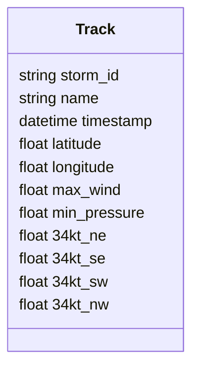
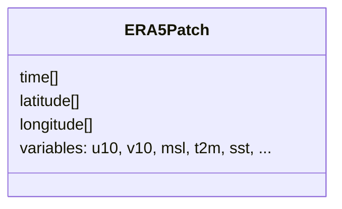

# Full Data Pipeline Walkthrough

This guide expands on `data_pipeline.md` with a step-by-step journey from raw
hurricane archives to the PyTorch tensors consumed by GaleNet models.

## Overview


## 1. Raw Data Ingestion

Run the setup script to fetch storm tracks and ERA5 samples. The command below
creates a working directory under `$HOME/data/galenet`.

```bash
python scripts/setup_data.py --all --data-dir $HOME/data/galenet
```

Expected layout after the download:

```
$HOME/data/galenet/
├── hurdat2/
│   └── hurdat2.txt
├── ibtracs/
│   └── IBTrACS.ALL.v04r00.nc
├── era5/
├── models/
└── cache/
```

## 2. Schema Normalisation

`HURDAT2Loader` and `IBTrACSLoader` parse their respective archives and merge
them into a unified track schema.



Each record is cast to numeric types and timestamps are converted to UTC
`datetime64` values.

## 3. ERA5 Patch Extraction

With a normalised track, the pipeline caches ERA5 reanalysis fields around the
storm path.

```python
from galenet import HurricaneDataPipeline
pipeline = HurricaneDataPipeline("configs/default_config.yaml")
storm = pipeline.load_hurricane_for_training(
    storm_id="AL092019",
    include_era5=True,
    patch_size=25.0,
)
```

The downloaded cube is sliced into time-aligned patches:



## 4. Dataset Assembly

Persist the combined track and ERA5 patches for repeatable experiments.

```python
from pathlib import Path
out_dir = Path("$HOME/data/galenet/processed/AL092019")
out_dir.mkdir(parents=True, exist_ok=True)
storm["track"].to_csv(out_dir / "track.csv", index=False)
storm["era5"].to_netcdf(out_dir / "era5.nc")
```

Resulting structure:

```
processed/AL092019/
├── track.csv
└── era5.nc
```

## 5. Configuration Example

A minimal configuration enabling ERA5 extraction and tensor creation:

```yaml
# configs/default_config.yaml
training:
  include_era5: true
  sequence_window: 3
  forecast_window: 2
```

## 6. Create Model-Ready Tensors

`HurricaneDataset` wraps the pipeline and emits synchronised PyTorch tensors.

```python
from galenet.training import HurricaneDataset, create_dataloader

dataset = HurricaneDataset(
    pipeline,
    storms=["AL092019"],
    sequence_window=3,
    forecast_window=2,
    include_era5=True,
)
loader = create_dataloader(dataset, batch_size=4, shuffle=False)
sequence, target, era5 = next(iter(loader))
print(sequence.shape)  # (batch, sequence_window, features)
print(target.shape)    # (batch, forecast_window, features)
print(era5.shape)      # (batch, forecast_window, era5_features)
```

The resulting tensors feed directly into GaleNet training and evaluation
routines.
